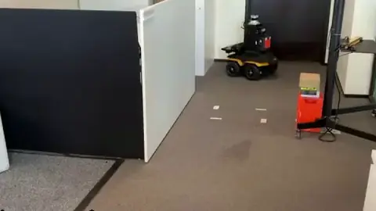

<h1 align="center">geodex_nav2_planner</h1>

<p align="center">
  A <a href="https://docs.nav2.org">Nav2</a> global planner on SE(2), built on
  <a href="https://github.com/utiasSTARS/geodex">geodex</a>.
</p>

<p align="center">
  <a href="https://github.com/utiasSTARS/geodex_nav2_planner/actions/workflows/jazzy.yml"></a>
  <a href="https://github.com/utiasSTARS/geodex_nav2_planner/actions/workflows/lyrical.yml"></a>
  <a href="https://docs.ros.org"></a>
  <a href="https://github.com/utiasSTARS/geodex"></a>
  <a href="https://geodex.readthedocs.io/en/latest/ros2/nav2.html"></a>
  <a href="LICENSE"></a>
</p>

<table>
  <tr>
    <td width="50%"></td>
    <td width="50%"></td>
  </tr>
  <tr>
    <td>A Clearpath Jackal drives a planned path through a narrow passage of an office.</td>
    <td>The office demo of this repository in RViz.</td>
  </tr>
</table>

`geodex_nav2_planner` plans on the Liegroup SE(2) with G-RRT* under a metric that weights forward,
sideways and turning motion, checks the full footprint polygon against the costmap, and smooths
the path with geodex's metric-aware smoother.

- **Plans in milliseconds.** A planning request returns a smooth, collision-free path in tens of
  milliseconds.
- **One metric for every base.** `wx`, `wy` and `wtheta` weigh forward, sideways and turning
  motion. A differential drive and a holonomic base differ only in the sideways weight `wy`.
- **The full footprint.** The planner checks the footprint polygon against the lethal cells of
  the costmap. The costmap does not need an inflation layer.
- **Reproducible.** A seed and an iteration budget give the same path on every run.

## ROS 2 distributions

| ROS 2 | Nav2 | Build and test |
|---|---|---|
| Jazzy | 1.3 | [](https://github.com/utiasSTARS/geodex_nav2_planner/actions/workflows/jazzy.yml) |
| Lyrical | 1.5 | [](https://github.com/utiasSTARS/geodex_nav2_planner/actions/workflows/lyrical.yml) |

Each workflow builds and tests the plugin on Ubuntu with apt and with pixi, and on macOS arm64 with
pixi. The plugin type is `geodex_nav2_planner::GeodexSE2Planner`, a `nav2_core::GlobalPlanner`.

The [Nav2 guide](https://geodex.readthedocs.io/en/latest/ros2/nav2.html) of the geodex
documentation has the walkthrough and every parameter.

## Quickstart with pixi

[pixi](https://pixi.sh) 0.81 or newer installs ROS 2, Nav2 and RViz from RoboStack and builds
geodex and the OMPL fork that holds G-RRT*.

1. Clone the repository.

   ```sh
   git clone https://github.com/utiasSTARS/geodex_nav2_planner.git
   cd geodex_nav2_planner
   ```

2. Build geodex and the plugin, and run the tests.

   ```sh
   pixi run -e jazzy test        # or -e lyrical
   ```

3. Start the office demo with RViz.

   ```sh
   pixi shell -e jazzy
   source install/jazzy/setup.bash
   ros2 launch geodex_nav2_planner office.launch.py robot:=jackal rviz:=true
   ```

4. In a second shell of the same environment, request a path.

   ```sh
   ros2 run geodex_nav2_planner office_plan.py
   ```

`GEODEX_SOURCE_DIR=/path/to/geodex` in front of a `pixi run` command builds against a local
geodex tree.

## Use it in Nav2

Set the planner server's plugin and the metric weights of your base.

```yaml
planner_server:
  ros__parameters:
    planner_plugins: ["GridBased"]
    GridBased:
      plugin: "geodex_nav2_planner::GeodexSE2Planner"
      wx: 1.0      # forward motion
      wy: 50.0     # sideways motion, 50 for a differential drive, 1.0 for a holonomic base
      wtheta: 2.0  # rotation
```

`config/nav2_params.yaml` holds the planner server and global costmap blocks of a working
bring-up, and `config/geodex_nav2_planner.example.yaml` lists every parameter.

- The planner checks the footprint against the lethal cells. The global costmap does not need an
  inflation layer.
- `safety_margin` sets how far the footprint stays from every lethal cell.
- For a holonomic base, set `max_reverse_run: -1.0`.
- With a nonzero `seed` and a `refine_iterations` budget, a request returns the same path on every
  run.
- `publish_footprints` publishes the footprint along the path for RViz.

`config/robots/` holds the footprints and weights of four Clearpath bases.

| file | base | `wy` | `max_reverse_run` |
|---|---|---|---|
| `jackal.yaml` | skid steer | 50 | 0.2 |
| `husky.yaml` | skid steer | 50 | 0.2 |
| `ridgeback.yaml` | mecanum | 1 | -1 |
| `dingo_o.yaml` | mecanum | 1 | -1 |

## Building without pixi

On a machine with ROS 2 Jazzy or Lyrical and Nav2, build geodex first and then the plugin.

1. Build geodex and the OMPL fork into a prefix of their own.

   ```sh
   bash scripts/build_deps.sh /opt/geodex_deps
   ```

2. Install the ROS dependencies.

   ```sh
   rosdep install --from-paths . --ignore-src --skip-keys geodex
   ```

3. Build the plugin against that prefix.

   ```sh
   colcon build --packages-select geodex_nav2_planner \
     --cmake-args -DCMAKE_BUILD_TYPE=Release -DCMAKE_PREFIX_PATH=/opt/geodex_deps
   ```

4. Run the tests.

   ```sh
   colcon test --packages-select geodex_nav2_planner
   colcon test-result --verbose
   ```

## Citation

If you use this plugin in your research, please cite the geodex paper.

```bibtex
@article{kyaw2026geodex,
  title   = {geodex: A Library for Motion Planning on {Riemannian} Manifolds},
  author  = {Kyaw, Phone Thiha and Wei, Ben and Samavi, Sepehr and
             {Rogel Garcia}, Miguel Angel and Kelly, Jonathan},
  journal = {arXiv preprint arXiv:26XX.XXXXX},
  year    = {2026},
  url     = {https://arxiv.org/abs/26XX.XXXXX}
}
```

## License

Copyright © 2026 Space and Terrestrial Autonomous Robotic Systems (STARS) Lab.

Apache-2.0. See `LICENSE`.
